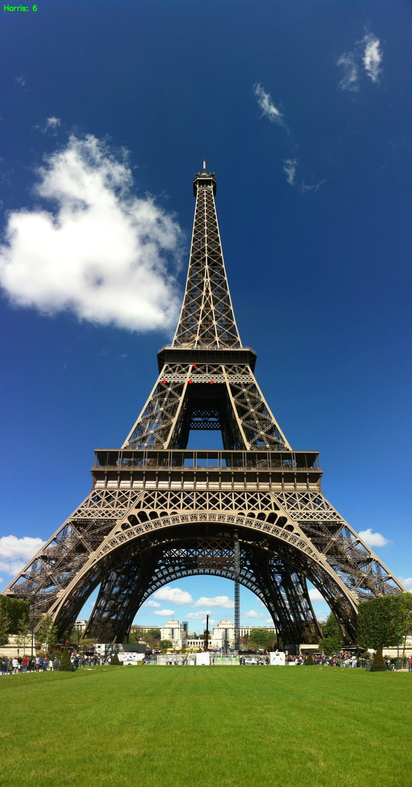
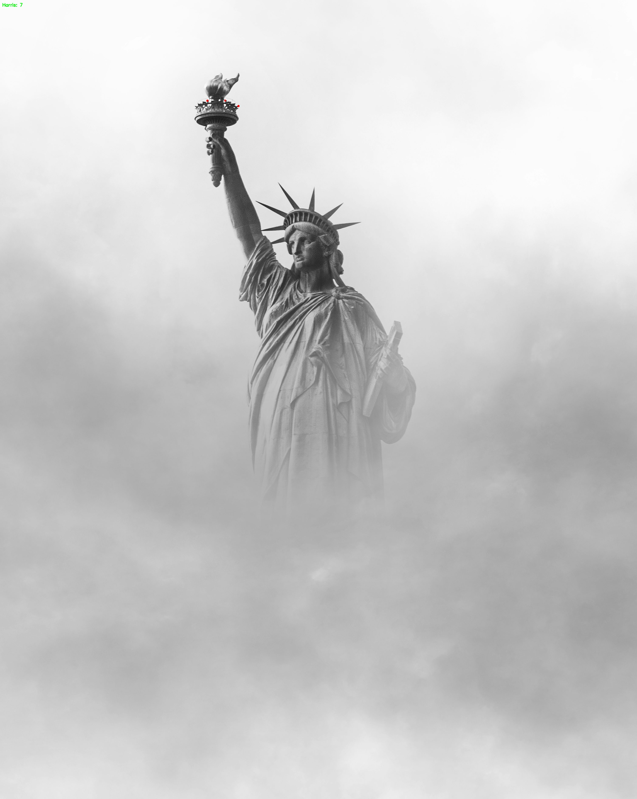
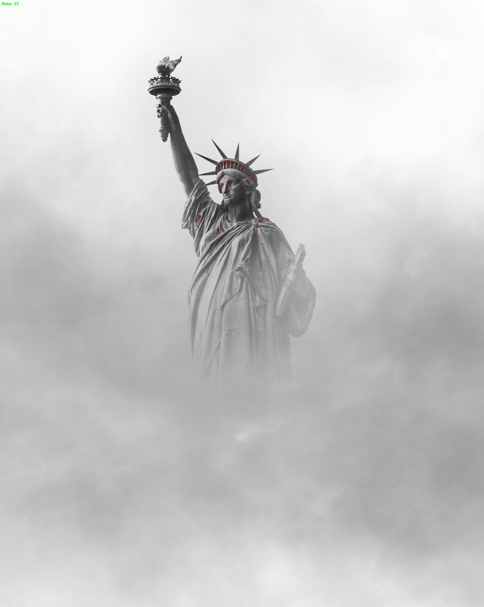
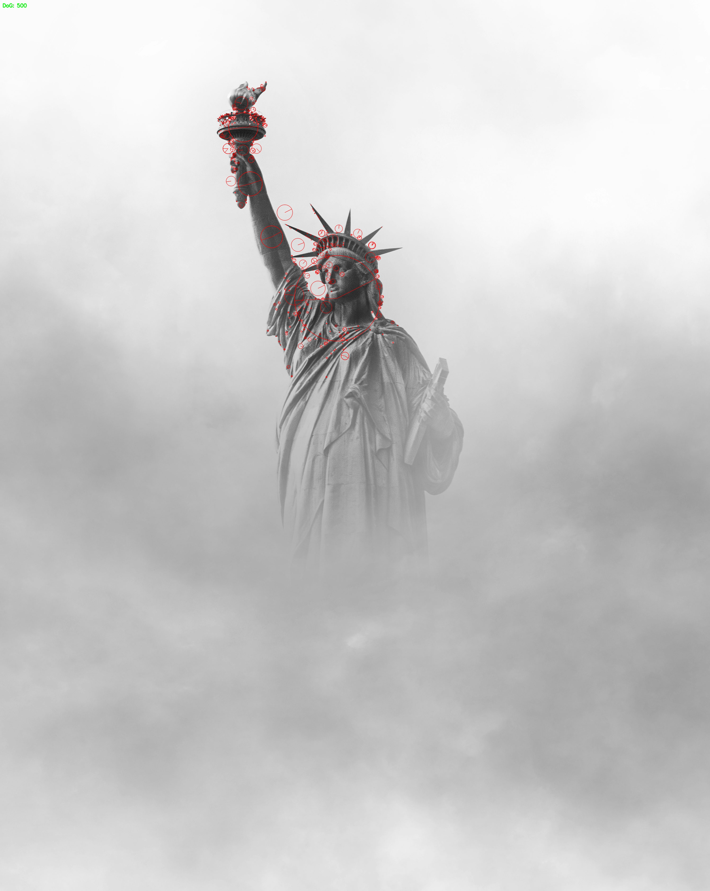
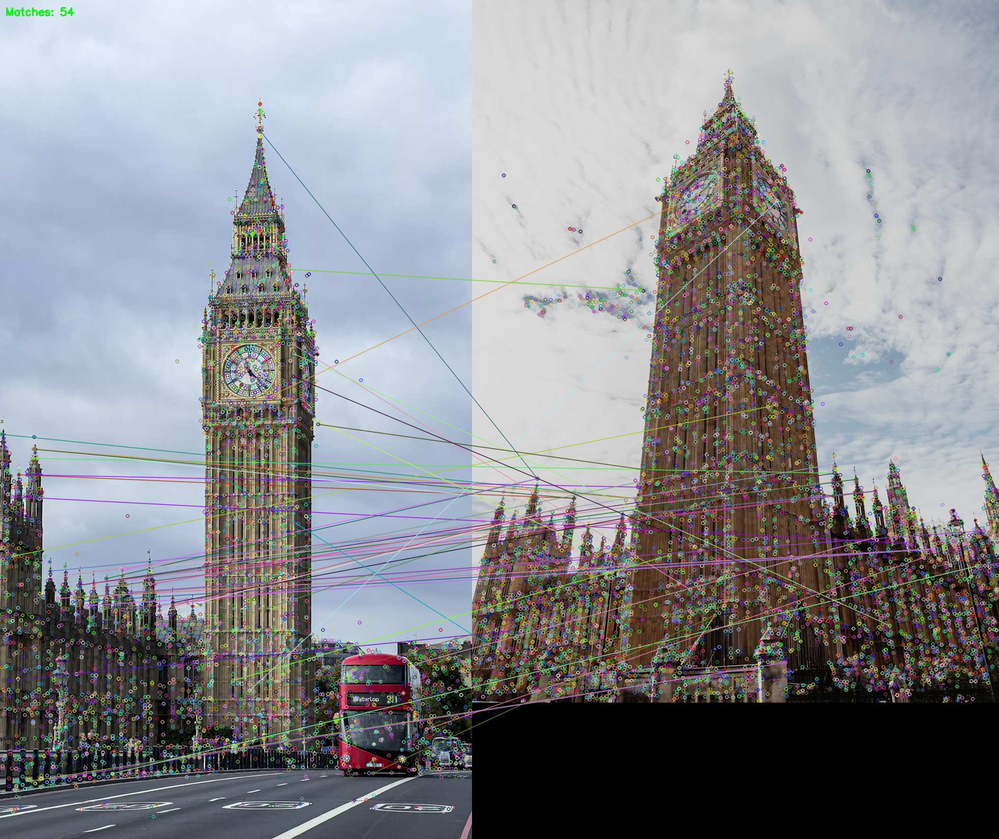
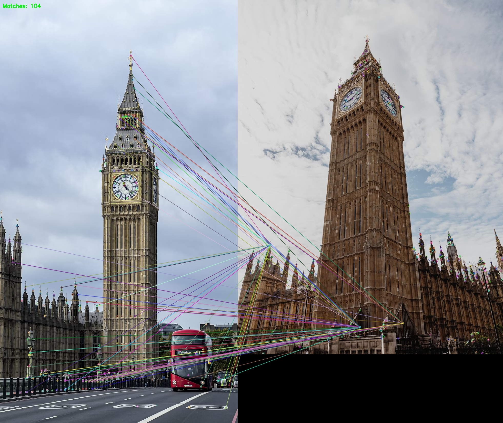
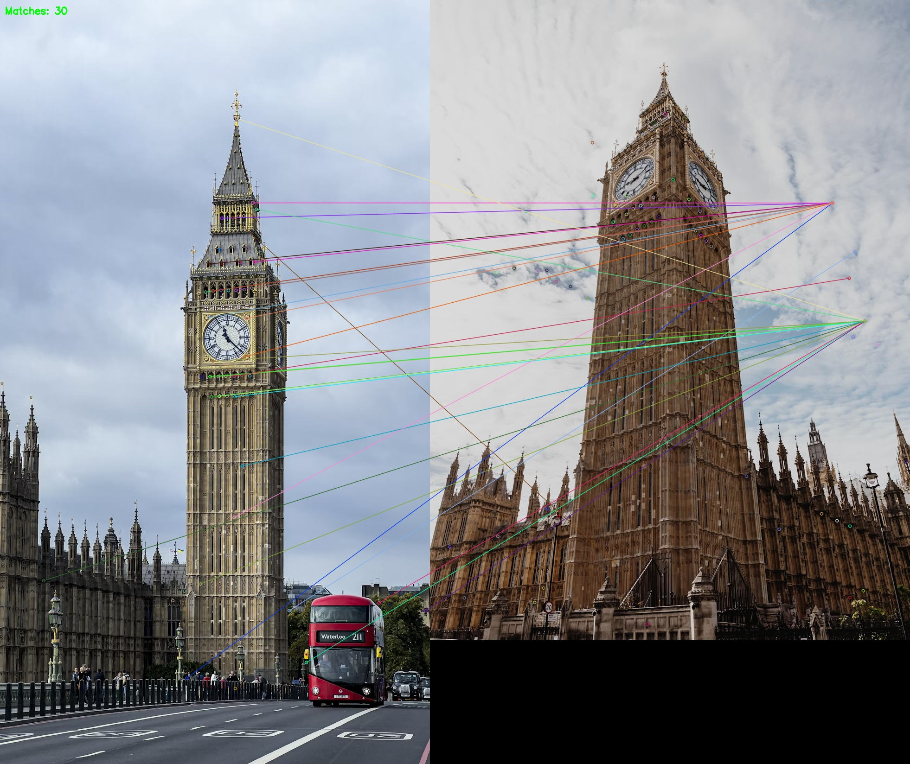
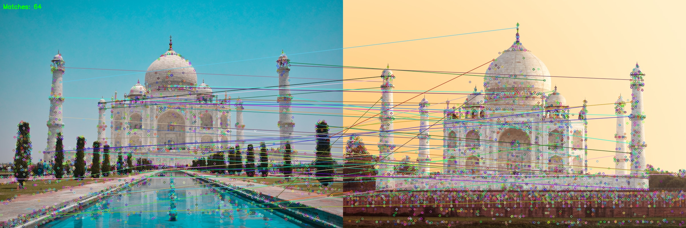
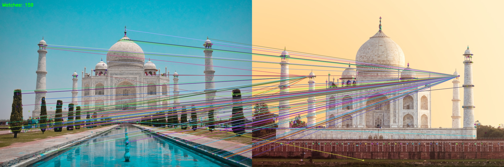
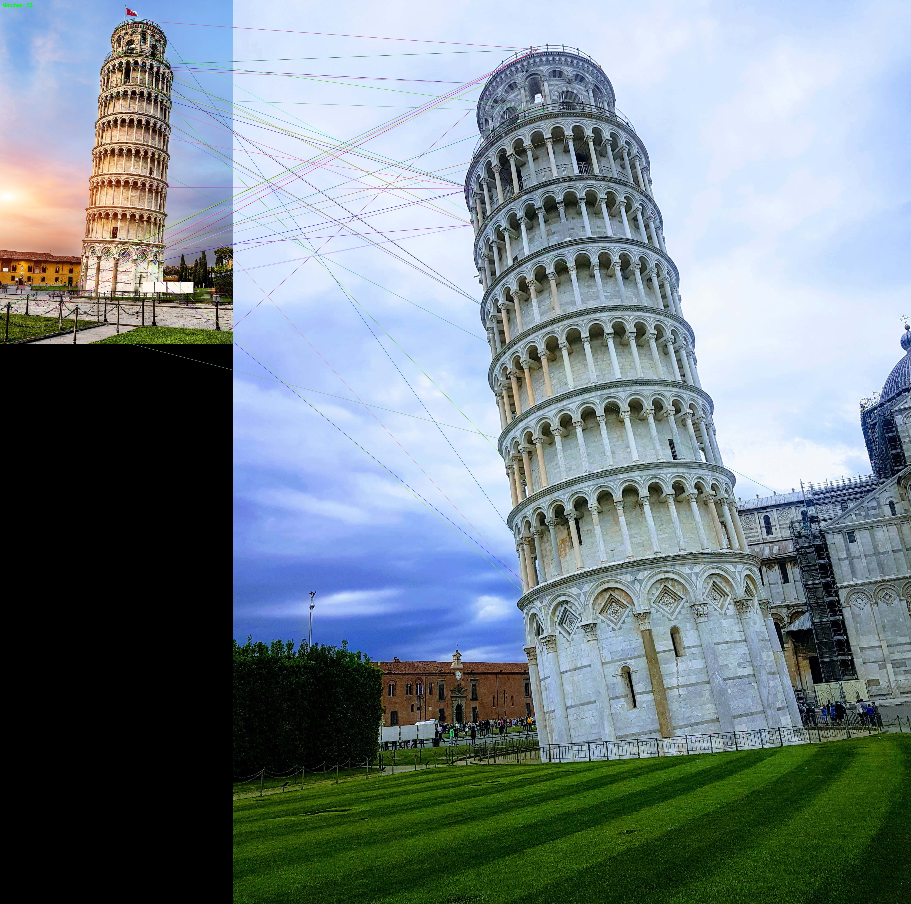

# CS412 - Computer Vision - Homework 02 Report

**Student Name:** Ngo Hoang Bach  
**Student ID:** 22125006  
**Date:** November 22, 2025

---

## 1. Problem Description

The following algorithms were implemented and evaluated:
*   **Detectors:** Harris Corner Detector, Blob Detector, Difference of Gaussians (DoG).
*   **Descriptors:** SIFT (Scale-Invariant Feature Transform), LBP (Local Binary Patterns).
*   **Matching:** KNN matching with ratio test.

## 2. Algorithm Descriptions & Implementation

### 2.1 Harris Corner Detector (Manual Implementation)
*   **Theory:** Detects corners by analyzing the eigenvalues of the structure tensor (second-moment matrix) of image gradients. A pixel is a corner if both eigenvalues are large.
*   **Implementation:** Implemented manually using `Sobel` for gradients, Gaussian smoothing for the structure tensor, and the Harris response function $R = \det(M) - k(\text{trace}(M))^2$.
*   **Parameters:** Block Size, Aperture Size, k-value, Threshold.

### 2.2 Blob Detector (Manual & OpenCV)
*   **Theory:** Detects regions in an image that differ in properties (brightness, color) compared to surrounding regions.
*   **Implementation:** Used OpenCV's `SimpleBlobDetector` which thresholds the image at multiple levels, extracts contours, and filters them based on spatial stability and shape properties (Area, Circularity, Convexity, Inertia).
*   **Parameters:** Min/Max Threshold, Min Area, Circularity, Convexity, Inertia Ratio.

### 2.3 Difference of Gaussians (DoG)
*   **Theory:** Approximates the Laplacian of Gaussian (LoG) to detect blob-like features at multiple scales. It is the keypoint detector used in SIFT.
*   **Implementation:** Utilized `cv::SIFT` to detect keypoints.
*   **Parameters:** Contrast Threshold, Edge Threshold, Sigma.

### 2.4 Descriptors
*   **SIFT:** Computes gradient orientation histograms in 4x4 subregions around the keypoint. Highly robust to scale and rotation.
*   **LBP (Custom Implementation):** Computes a binary code for each pixel by comparing it with its 8 neighbors. A histogram of these codes is built for the patch around a keypoint.
    *   **Matching Metric:** Chi-Square Distance (`HISTCMP_CHISQR`) was used for LBP matching as it is more suitable for histograms than Euclidean distance.

## 3. Experimental Evaluation

The algorithms were evaluated on a dataset of 5 objects, with 3 images per object taken from different angles and distances.

**Test Objects:**
1.  **Eiffel Tower** (Structure with fine details)
2.  **Pisa Tower** (Inclined structure, distinct background)
3.  **Statue of Liberty** (Complex shape, varying lighting)
4.  **Big Ben** (Repetitive patterns on clock face)
5.  **Taj Mahal** (Symmetrical, white marble texture)

---

### 3.1 Detection Results

#### Eiffel Tower
|                        Harris (Corners)                         |                      Blob (Regions)                       |                 DoG (Scale Invariant)                  |
| :-------------------------------------------------------------: | :-------------------------------------------------------: | :----------------------------------------------------: |
|  |  |  |

*   **Harris:** Successfully detects the high-frequency corners of the iron lattice structure.
*   **Blob:** Detects the dark gaps between the iron bars against the sky.
*   **DoG:** Detects keypoints at various scales, capturing both fine details and larger structural elements.

#### Statue of Liberty
|                              Harris                               |                            Blob                             |                           DoG                            |
| :---------------------------------------------------------------: | :---------------------------------------------------------: | :------------------------------------------------------: |
|  |  |  |

*   **Observation:** Harris concentrates on the spikes of the crown and folds in the robe. DoG provides a dense coverage of the statue's surface texture.

---

### 3.2 Matching Results

We compared the performance of different Detector + Descriptor combinations.

#### Big Ben (Repetitive Patterns)
| Detector   |                    SIFT Descriptor                     |                    LBP Descriptor                     |
| :--------- | :----------------------------------------------------: | :---------------------------------------------------: |
| **Harris** |  |  |
| **DoG**    |     |     |
| **Blob**   |    |    |

*   **Analysis:** Big Ben's clock face has repetitive patterns. SIFT handles this well due to its distinctiveness. LBP struggles slightly more with the repetitive brick textures, generating some false matches in the background.

#### Taj Mahal (Symmetry & Texture)
| Detector   |                     SIFT Descriptor                      |                     LBP Descriptor                      |
| :--------- | :------------------------------------------------------: | :-----------------------------------------------------: |
| **Harris** |  |  |
| **DoG**    |     |     |

*   **Analysis:** The DoG + SIFT combination provides the most robust matching across the change in perspective. Harris + LBP works reasonably well but has fewer matches due to the lack of strong corners on the smooth dome.

#### Pisa Tower (Inclination)
|                       DoG + SIFT                       |                       DoG + LBP                       |
| :----------------------------------------------------: | :---------------------------------------------------: |
|  |  |

---

## 4. Performance Analysis & Conclusion

### 4.1 Strengths and Weaknesses

| Algorithm           | Strengths                                                                                                                                             | Weaknesses                                                                                                           |
| :------------------ | :---------------------------------------------------------------------------------------------------------------------------------------------------- | :------------------------------------------------------------------------------------------------------------------- |
| **Harris Detector** | - Very fast and efficient. - Accurate localization of corners. - Invariant to rotation.                                                         | - Not invariant to scale changes. - Sensitive to noise. - Threshold dependent.                                 |
| **Blob Detector**   | - Good for detecting circular/elliptical regions. - Useful for specific object markers.                                                            | - Slower than Harris. - Can miss features in complex textures. - Sensitive to lighting changes (thresholding). |
| **DoG Detector**    | - **Scale Invariant:** Detects features at multiple sizes. - Robust to rotation and illumination changes. - Best overall detection performance. | - Computationally expensive. - Can detect edges as keypoints (needs filtering).                                   |
| **SIFT Descriptor** | - Highly distinct and robust. - Handles rotation and scale changes excellently.                                                                    | - Slow to compute. - High dimensionality (128-d).                                                                 |
| **LBP Descriptor**  | - **Very Fast:** Simple integer arithmetic. - Good at capturing local texture. - Rotation invariant (uniform LBP).                              | - Less distinct than SIFT. - Sensitive to noise in flat regions. - Not inherently scale invariant.             |

### 4.2 Conclusion

In this assignment, we successfully implemented a comprehensive computer vision tool for feature detection and matching.
*   **Best Overall Combination:** **DoG + SIFT**. This pair consistently provided the most reliable matches across all test cases, handling scale and rotation changes effectively (e.g., matching the Taj Mahal from different distances).
*   **Fastest Combination:** **Harris + LBP**. This combination is computationally lightweight and suitable for real-time applications where scale invariance is not critical.
*   **Blob Detection:** While useful for specific shapes, it was generally less effective for general feature matching on natural scenes compared to Harris or DoG.

The interactive application allows for real-time parameter tuning, which proved essential for adapting the algorithms to different lighting conditions and object types.
